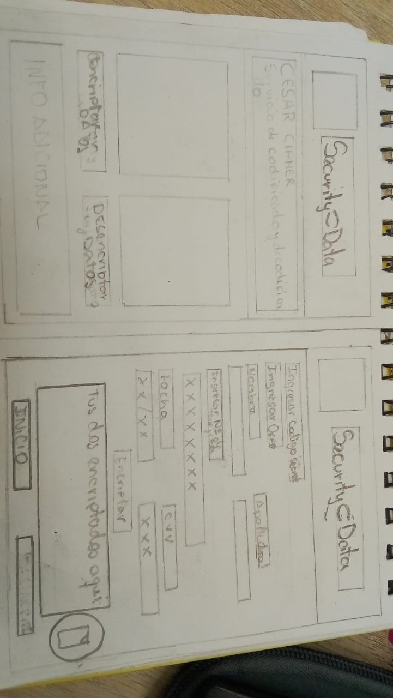
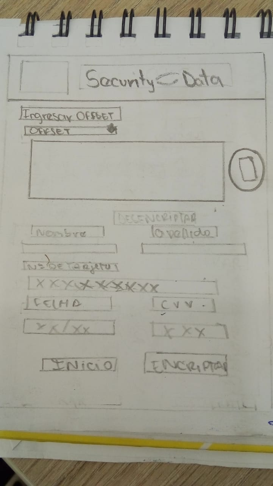

## Security Data

En la actualidad la información es uno de los principales recursos de las empresas bancarias tanto como para los usuarios. Atualmente las redes sociales son medios por donde viaja información.
Con el extendido y personal uso dado hoy a internet, la encriptación de datos en la web es necesaria para proteger muchos datos personales de los usuarios que pueden estar al alcance de atacantes y atentar estos contra la integridad y confidencialidad de la persona, accediendo a datos muy personales y, por tanto, muy sensibles.

## Encripta tus datos de manera segura con el metodo de Caesar Cipher

Cifrado: garantiza que la información no es inteligible para individuos, entidades
o procesos no autorizados a través de lo cual proporciona confidencialidad a la
información, consiste en transformar un texto en claro mediante un proceso de
cifrado en un texto cifrado, gracias a una clave de cifrado.

El cifrado César es uno de los primeros métodos de cifrado conocidos. El emperador romano Julio César lo usaba para enviar órdenes secretas a sus generales en los campos de batalla.

El cifrado césar es una de las técnicas más simples para cifrar un mensaje. Es un tipo de cifrado por sustitución, es decir que cada letra del texto original es reemplazada por otra que se encuentra un número fijo de posiciones (desplazamiento) más adelante en el mismo alfabeto.

Por ejemplo, si usamos un desplazamiento (offset) de 3 posiciones:

La letra A se cifra como D. La palabra CASA se cifra como FDVD. Alfabeto sin cifrar: A B C D E F G H I J K L M N O P Q R S T U V W X Y Z Alfabeto cifrado: D E F G H I J K L M N O P Q R S T U V W X Y Z A B C En la actualidad, todos los cifrados de sustitución simple se descifran con mucha facilidad y, aunque en la práctica no ofrecen mucha seguridad en la comunicación por sí mismos; el cifrado César sí puede formar parte de sistemas más complejos de codificación, como el cifrado Vigenère, e incluso tiene aplicación en el sistema ROT13.

## Objetivos de la encriptacion

el objetivo original de la Criptografía era mantener en secreto un
mensaje, en la actualidad no se persigue únicamente la privacidad o confidencialidad de
los datos, sino que se busca además garantizar la autenticación de los mismos mediante uuna clave secreta (offset)

#### Definición del producto

## ¿Quiénes son los principales usuarios de producto?.

los principales usuarios de producto son usuarios de bancos qe necesiten compartir su informacion de manera segura, mediante la app Security Data para hacerlo de manera rapida y simple.

## ¿Cuáles son los objetivos de estos usuarios en relación con tu producto?.

Los principales objetivos del usuario al usar la app Security Data son poder compartir su informacion personal de manera segura. El usuario podra ingresar sus datos a encriptar pero no quedara registro de este. en los datos a encriptar encontrara un formlario donde le pedira principalmente que ingrese un codigo secreto que debera compartirlo con su receptor para que asi mismo pueda desencritar el mensaje. Luego sus datos como su nombre y apellidos, su numero de tarjeta, su fecha y su cvv.

## ¿Cómo crees que el producto que estás creando está resolviendo sus problemas?.

La app Security Data esta resolviendo problemas de ataques ciberneticos a bancos y a usuarios asi mismo previniendo casos de vulnerabilidad, amenazas, ataques de seguridad, etc. Con el sistema de encriptado Caesar Cipher podra encriptar sus datos de manera segura y evitar el robo de datos.

### Interfaz de usuario (UI)

#### Prototipo de baja fidelidad

La interfaz permite al usuario:
- Elegir un desplazamiento (_offset_) indicando cuántas posiciones queremos que el cifrado desplace cada caracter.
- Insertar un mensaje (texto) que queremos cifrar.
- Ver el resultado del mensaje cifrado.
- Insertar un mensaje (texto) a descifrar.
- Ver el resultado del mensaje descifrado.